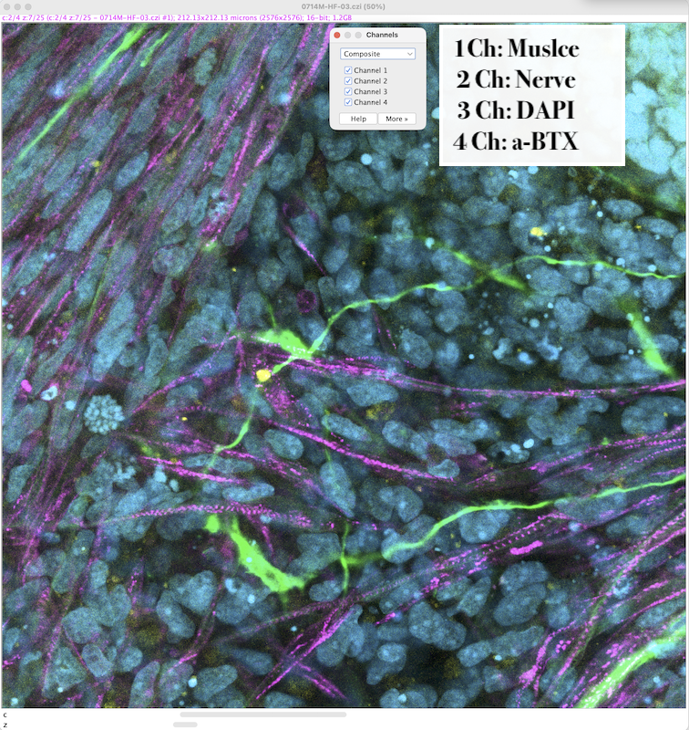
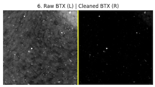

# Neuromuscular Junction (NMJ) Analysis Pipeline

A fully containerized image analysis toolkit that detects, measures, and classifies Neuromuscular Junctions (NMJs) from multi-channel z-stack confocal `.czi` files.

`.czi`  file should have 1. muscle staining channel, 2. neuron staining channel, and 3. alpha-bungarotoxin staining channel. Image can have extra channel but not be used in this pipeline. Strongly recommend to take high resolution image with high maginification lens (Bit: 16, Image size: ≥2000x2000, Lens: ≥40x, Z-stack image). Z-stack will convert to max projection inside the pipeline.



Intended as a streamlined alternative to FIJI / TrackMate-heavy workflows.

## System Architecture

The app runs in Docker with **Streamlit** UIs. **Single-image** and **batch** are separate Compose **profiles**: you start **one** service at a time so only **one** process and **one** port are active, and the configured **memory limit** applies to that container (helpful for large tiles and deep Z-stacks).


Plain `docker compose up` with **no** `--profile` does not start either app (by design).

## Quick Start

1. **Data:** Put `.czi` files in subfolders under this project. e.g. `/Users/username/NMJanalysis/Experiment1/image.czi`. The compose file bind-mounts the repo to `/app` inside the container.
2. **Start one pipeline** Open terminal and
```bash
   cd /Users/username/NMJanalysis/Experiment1/

   docker compose --profile single up --build
   # or
   docker compose --profile batch up --build
   ```
   Keep the terminal window open during your analysis and use the terminal window for the rest of the commands.

3. Open **`http://localhost:8501`** in the browser.

4. Set up analysis configurations in the browser.

   - **Channel Setup:** Assign the muscle, nerve, and BTX imaging channels for each dataset folder. (Note: The pixel size will be detected automatically).
   - **Spot Detection:** Configure your spot detection parameters. The default NMJ spot size range is 5–12 µm. It is highly recommended to enable Auto Threshold per image and Auto-Optimize Background Subtraction Radius.
   - **Validation Plots:** Enabling the option to save per-image NMJ plot PNGs during batch processing will consume additional memory, but it generates a valuable validation plot for every individual image.
   - **Spot detection Threshold:** If the muscle or nerve staining appears faint, increase the DoG threshold (Detection Threshold and DoG sigma). Because this adjustment can introduce artifacts, be sure to review the per-image NMJ plots to verify your results.
   - **NMJ Logic:** This setting defines the acceptable distance from the BTX signal to assume that the BTX staining is correctly associated with the surrounding proximity tissues (i.e., the muscle and nerve).
   - **The output** is written under `data/<dataset>/` next to your inputs, with batch “ALL Folders” summaries under `data/` when you use that mode.


5. **Stop:** `Ctrl+C` in the terminal, or 

   ```bash
   docker compose down
   ```


## Docker Memory

`docker-compose.yml` sets a **12 GB** memory limit per service. If you see exits with code **137** (OOM), raise **Docker Desktop → Settings → Resources → Memory** so the Linux VM can supply that headroom and leave margin for the host OS.

For very long batch runs, use the **"Save per-image NMJ_Plot PNGs"** option wisely (disabling it reduces peak memory).

---

## Features & Methodologies

### 1. Robust spot detection (Difference of Gaussians)

The pipeline subtracts broad diffuse background from the BTX channel using a large-sigma Gaussian blur. A smoothed background image is computed with σ = max(50 µm, 5 × max spot diameter), which is well above the largest expected cluster, and then subtracted from the raw image. This removes wide haze and muscle auto-fluorescence while preserving sharp puncta, and avoids the "donut" hollowing artifact that occurs when the background kernel is too close in size to the signal.



The pipeline uses skimage's `blob_dog` on the BTX (receptor) channel. A **morphological white top-hat** (rolling-ball–style background suppression) runs first when enabled.

Spot size in the UI is expressed as **diameter in μm** (min / max). Internally, diameters are converted to Gaussian sigmas for DoG:

```
sigma_um = diameter_um / (2 × sqrt(2))
```

**Auto DoG threshold:** `estimate_auto_threshold()` computes `median + 3 × (1.4826 × MAD)` on positive pixel values (> 0.005) in a subsampled, haze-subtracted BTX image, clamped to `[0.02, 0.12]`. **Auto threshold sensitivity** sets skimage `blob_dog` **`sigma_ratio`**: **Conservative (1.6)** or **High (1.3)** (shown explicitly in the UI). With a **manual** detection threshold, use **DoG sigma ratio (manual)** (default **1.6**, same as Auto Conservative).

### 2. Physical units (μm)

Pixel size **μm/pixel** is read from `.czi` metadata where possible. Distances and spot radii are reported in **micrometers**.

On large spot-diameter settings, the code may downscale for DoG stability and maps spots back to full resolution; DoG sigma and background radius are capped to limit memory use.

### 3. Biological and spatial metrics

For each spot, segmentation uses a **fixed threshold tied to DoG detection** (normalized threshold × 99.9th percentile of haze-subtracted BTX), with Otsu only as a fallback on degenerate crops—this avoids splitting dim spot rims on black-dominated windows.

| Column | Description |
|--------|-------------|
| `Dist_to_Muscle_um` | Edge-corrected EDT: center-to-mask distance minus spot radius (µm), clamped at 0 |
| `Dist_to_Neuron_um` | Same, for neuron mask |
| `Dist_to_Muscle_center_um` | EDT at the blob center only (µm), for QC/comparison |
| `Dist_to_Neuron_center_um` | EDT at the blob center only (µm), for QC/comparison |
| `INNERVATION_OVERLAP_PCT` | Overlap fraction (%) of the spot mask with the neuron channel |
| `MEAN_INTENSITY` | Mean raw intensity inside the spot mask (haze-subtracted BTX) |
| `ROUNDNESS` | `1 − eccentricity` derived from the inertia tensor eigenvectors (see below) |
| `RADIUS` | Spot radius in µm |
| `Resolution_Class` | `"Low-Res"` if pixel size > 0.5 µm/px, otherwise `"High-Res"` |

**Muscle haze removal:** subtracts a wide Gaussian from the BTX channel. The haze σ (µm) is `max(50, 5 × max spot diameter)` so large plaques are less likely to show a "donut" after subtraction (not a separate control).

Batch outputs use every DoG detection that passes diameter filtering—there is **no** muscle-vs-BTX intensity rejection step.

### 4. Shape metric: ROUNDNESS (1 − eccentricity)

Shape is now reported as **ROUNDNESS = 1 − eccentricity**, computed from the inertia tensor eigenvectors (`skimage.measure.regionprops`, `inertia_tensor_eigvals`). A value of `1.0` is a perfect circle; values near `0` are highly elongated.

This replaces the legacy perimeter-based `CIRCULARITY` (`4πA/P²`), which was unreliable at low resolution because pixelated edges artificially inflate the perimeter even for round objects.

**Resolution gating:** any spot whose segmented mask has fewer than `MIN_PIXELS_FOR_SHAPE = 20` pixels gets `ROUNDNESS = NaN`. These rows are excluded from Roundness KDE plots via `dropna`, preventing noisy low-resolution spots from flattening the distribution.

**Backward compatibility:** CSVs written before the terminology update that contain a `CIRCULARITY` column (but no `ROUNDNESS` column) are automatically aliased — `ROUNDNESS = CIRCULARITY` — so existing result files still load correctly in the summary dashboards.

### 5. BTX signal classification (4 classes)

Each detected spot is assigned one of four classes based on its edge-corrected distances to the muscle and neuron masks:

| Class | Color | Condition |
|-------|-------|-----------|
| **NMJ** | red | near both muscle **and** neuron |
| **Aneural AChR clusters** | green | near muscle only |
| **Neuron-associated BTX signal** | blue | near neuron only |
| **Orphaned** | gray | near neither mask |

"Near" is defined by the **Functional NMJ Boundary (μm)** slider (default `1.0 µm`), applied to edge-corrected distances.


### 6. Statistical tests

All p-values are annotated with significance stars: `***` p < 0.001 · `**` p < 0.01 · `*` p < 0.05 · `ns` p ≥ 0.05.

**Where each test appears**

| Test | What is compared | Batch: per-image `*_NMJ_Plot.png` | Batch: aggregate `BATCH_SUMMARY*.png` / `ALL_FOLDERS_SUMMARY*.png` | Single-image `BTX.py` |
|------|------------------|-----------------------------------|----------------------------------------------------------------------|-------------------------|
| Mann–Whitney (docking) | `Dist_to_Neuron_um`: **NMJ** vs **Aneural AChR clusters** (`alternative="less"`) | Panel **1** title | Panel **1** (global proximity) title | Panel **1** title + Results markdown |
| Kruskal–Wallis (roundness) | `ROUNDNESS`: **NMJ** vs **Aneural** vs **Neuron-associated** (3 groups) | Panel **3** title | Panel **3** title | Panel **3**: plot only (title is static) |
| Mann–Whitney (intensity) | `MEAN_INTENSITY`: **NMJ** vs **Orphaned** (`alternative="greater"`, all spots pooled) | Panel **5** title | Panel **5** title + optional enrichment line in Streamlit | **Not** computed in the single-image UI; Panel **5** title is static |
| Friedman (zone density) | Per-image area-normalised densities: Muscle vs Neuron vs Orphan zones | — | Panel **6** (“BTX Enrichment”) when the batch run finishes | — |

**Independence caveat:** Mann–Whitney and Kruskal–Wallis on pooled spots treat each spot as a unit; spots in one image are correlated. Use pooled p-values as **exploratory** unless you redesign (e.g. per-image summaries + mixed models). The **Friedman** test is explicitly **paired per image** (one row per image, three zone densities).

**Proximity scatter (Panel 1):** when many spots share the same edge-corrected distance (often after clipping to 0 µm), the scatter plot applies a **small display-only jitter** so markers do not stack invisibly; **CSV values and marginal KDEs use the true coordinates**. Total spot count `n=` in the title matches the number of detected spots.

---

**Synaptic docking precision (Mann–Whitney U) — Panel 1**

*What it asks:* Among spots that are near muscle, do true NMJs (also near the neuron channel) sit **closer to the neuron mask** than muscle-only “Aneural AChR clusters”? That is a direct readout of tighter synaptic docking in physical micrometers.

*How it works:* Edge distances `Dist_to_Neuron_um` (already stored per spot) are compared between the **NMJ** class and the **Aneural AChR clusters** class. A one-sided Mann–Whitney U test (`scipy.stats.mannwhitneyu`, `alternative="less"`) asks whether NMJ distances are stochastically **smaller** than aneural distances. At least 3 spots per group are required; fewer images show “Insufficient clusters” in the panel title.

Spots within one field of view are not statistically independent; treat the p-value as **exploratory** unless you aggregate appropriately (e.g. per-image effect sizes or hierarchical models).

The p-value, stars, and group medians appear in the **Panel 1 – Proximity Scatter** title for every individual image, and the same logic applies to the global all-spots summary when Panel 1 pools many images.

---

**Mann-Whitney U Test (receptor intensity) — Panel 5**

*What it asks:* Are **NMJ** spots brighter than **Orphaned** spots when all detected spots are pooled?

*How it works:* All `MEAN_INTENSITY` values are pooled by class, then NMJ is compared against Orphaned spots using one-sided Mann-Whitney U (`scipy.stats.mannwhitneyu`, `alternative="greater"`). This directly tests whether the NMJ intensity distribution is shifted to higher values than the orphaned/background control distribution, without reducing each image to a median first. At least 3 spots per class are required; otherwise the panel reports "Insufficient Clusters".

The p-value, significance star, and class medians appear in the **Panel 5 – Receptor Intensity KDE** title on **batch** figures (e.g. `Mann-Whitney P = 0.0031 **`). The single-image app (`BTX.py`) does not run this test in Streamlit yet; use the batch pipeline for that summary.

---

**Kruskal-Wallis Test (roundness morphology) — Panel 3**

*What it asks:* Does receptor-cluster morphology differ across the three biologically relevant environments: **NMJ**, **Aneural AChR clusters**, and **Neuron-associated BTX signal**?

*How it works:* `ROUNDNESS` is compared across the three groups using a 3-way Kruskal-Wallis H-test (`scipy.stats.kruskal`). Quality control matches the plotting logic: only spots with `AREA_PX >= MIN_PIXELS_FOR_SHAPE` and non-null `ROUNDNESS` are included; Orphaned spots are excluded from this 3-way morphology test. At least 3 valid spots per group are required, otherwise the title reports insufficient group size.

The p-value, significance star, and all three group medians appear in the **Panel 3 – Roundness KDE** title in **batch** outputs. The single-image app plots the same three classes but leaves a static axis title (no Kruskal line in `BTX.py` yet).

---

**Friedman Test (BTX zone specificity) — batch aggregate dashboard, Panel 6**

*What it asks:* Does BTX spot density differ significantly across the three tissue zones (muscle zone, neuron-only zone, and orphan zone) when compared **within the same image**?

*How it works:* For each image, spots are counted in each zone and divided by the zone's area (µm²) to give an area-normalised density. This produces three matched columns across images (one row = one image, three columns = three zone densities). The Friedman test (`scipy.stats.friedmanchisquare`) is a non-parametric repeated-measures test that ranks the three densities within each image. Because each image serves as its own block, between-image variability in overall BTX signal strength is partially controlled when comparing zones.

A significant result suggests BTX staining is not uniformly distributed across the zones. The p-value and star appear in the **Panel 6 – BTX Enrichment** title on the **saved batch summary figure** (`BATCH_SUMMARY*.png` or `ALL_FOLDERS_SUMMARY*.png`). This is **not** the same “Panel 6” as in the per-image `*_NMJ_Plot.png` grid (that figure uses different panel numbering).

---

## Using the Batch System

With **`docker compose --profile batch up --build`**:

1. Select a folder that contains your `.czi` files.
2. Set the **config template** (muscle / neuron / BTX channels) at the top.
3. Use **"Paste Template to ALL Images"** or per-file expanders. Pixel sizes from metadata are not overwritten by paste where noted.
4. **Exclude** bad files with the skip checkboxes if needed; **Save Settings to Folder** writes `channel_mapping_config.json` for the next run.
5. **Run Batch Analysis (Current Folder)** or **(ALL Folders)** as required.

**Recursive `.czi` discovery:** the batch runner uses `collect_czi_jobs()` to walk subdirectories, so `.czi` files nested inside sub-folders (e.g. `Data/Cond1/slide/image.czi`) are included automatically.

**Per-folder configs:** when running ALL Folders, each folder's `channel_mapping_config.json` is loaded automatically if present, so each dataset keeps its own channel mapping.

---

## Outputs (batch)

Artifacts are written next to the data. **ALL Folders** runs additionally write aggregate files in the **project root** (the app working directory, `/app` in Docker).

When **Auto Threshold per image** is enabled, filenames include a sensitivity tag so Conservative and High runs do not overwrite each other: `_thrConservative` or `_thrHigh` (e.g. `ALL_FOLDERS_MASTER_RESULTS_thrHigh.csv`). With manual threshold, that tag is omitted.

| File | Scope | Description |
|------|-------|-------------|
| `ALL_FOLDERS_MASTER_RESULTS[_thrTag].csv` | project root | Combined spot table for all-folder runs, with `SOURCE_FOLDER` and `SOURCE_IMAGE` columns |
| `ALL_FOLDERS_SUMMARY[_thrTag].png` | project root | Aggregate dashboard (3×2 or 4×2 when **ALL Folders**; includes docking / Kruskal / intensity titles and Friedman panel 6) |
| `ALL_FOLDERS_SUMMARY_TABLE[_thrTag].csv` | project root | Per-folder summary statistics |
| `BATCH_MASTER_RESULTS[_thrTag].csv` | selected folder | Combined spot table for current-folder runs |
| `BATCH_SUMMARY[_thrTag].png` | selected folder | Aggregate dashboard for the current folder |
| `[Filename][_thrTag]_analysis.csv` | next to image | Per-image spot table |
| `[Filename][_thrTag]_NMJ_Plot.png` | next to image | 10-panel figure (optional; can be disabled) |

The per-run **batch summary metrics** table in Streamlit includes a **`Docking Mann-Whitney P`** column (synaptic docking test per image; `NaN` if fewer than 3 NMJ or 3 Aneural spots).

### Per-image 10-panel figure layout (4 × 3 grid)

| Row | Col 0 | Col 1 | Col 2 |
|-----|-------|-------|-------|
| 0 | **1. Proximity scatter** (synaptic docking Mann–Whitney P) + marginal KDEs | **2. Size KDE** (radius by class) | **3. Roundness KDE** (3-way Kruskal + medians) |
| 1 | **4. Innervation Distribution** (overlap %) | **5. Receptor Intensity KDE** (Mann-Whitney P) | **6. Raw BTX (L) \| Cleaned BTX (R)** |
| 2 | **7. Cleaned BTX** | **8. Cleaned BTX + Detected Spots** | **9. Composite + All Spots** |
| 3 | **10. Composite + Functional NMJs only** | *(density bar chart)* | *(unused)* |

### Aggregate dashboard layout (`BATCH_SUMMARY*.png` / `ALL_FOLDERS_SUMMARY*.png`)

After a batch finishes, these files mirror the **Global** figure shown in Streamlit: pooled spots from `BATCH_MASTER_RESULTS*.csv` or `ALL_FOLDERS_MASTER_RESULTS*.csv`.

| Slot | Content |
|------|---------|
| **1** | Global proximity scatter + marginal KDEs (docking Mann–Whitney in title) |
| **2** | Global size KDE (radius by class) |
| **3** | Global roundness KDE (3-way Kruskal in title) |
| **4** | Global NMJ innervation histogram |
| **5** | Global intensity KDE (NMJ vs Orphaned Mann–Whitney in title) |
| **6** | BTX zone-density box/strip plot (Friedman P in title) |
| **7** | *(ALL Folders only)* Per-image NMJ rate strip + folder means (full-width row below the 3×2 block) |

**Current folder** runs use a **3×2** grid (panels 1–6). **ALL Folders** adds a fourth row so the layout is **4×2** with the control chart spanning both columns.

The helper `save_all_folders_summary_png()` in `BTX_batch.py` builds a **3×2** figure of **per-folder** summaries (NMJ rate, total spots, mean radius, mean innervation overlap, scatter of folder median muscle vs neuron distances) plus **panel 6**: pooled **All-Folders Proximity** with the same docking Mann–Whitney title as the live dashboard. It is **not** invoked by the Streamlit batch buttons; call it from your own script if you want that layout.
